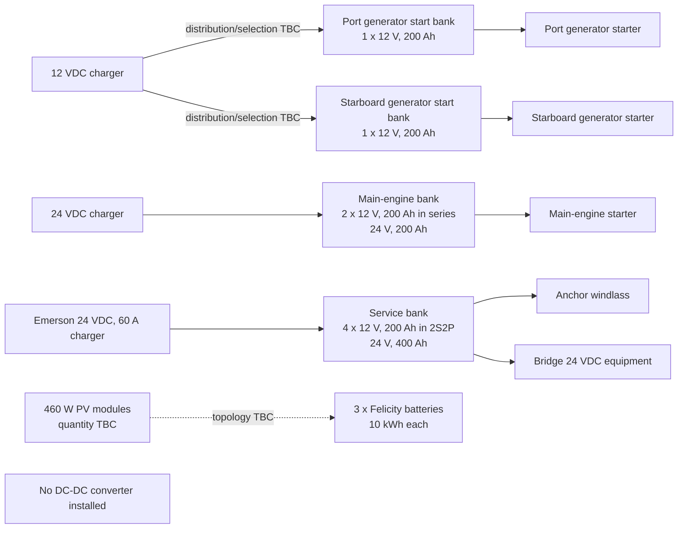
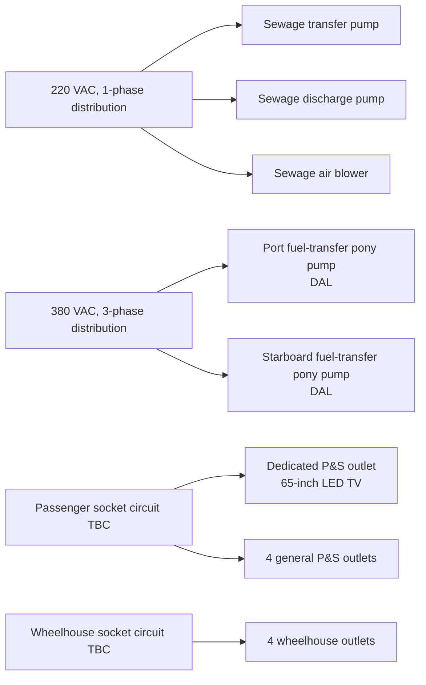

# Ferry Systems Overview

**Document status:** controlled as-built data summary 
**Revision date:** 2026-09-16 
**Companion register:** [`ferry_main_asset_list.csv`](ferry_main_asset_list.csv)

## 1. Scope and data-control notes

This document is the single narrative reference for the ferry equipment details supplied by the owner. The companion CSV is the sortable main asset register. Quantities, voltages, phases, locations, duties, and interconnections below are confirmed only where stated in the source update.

No ferry photographs, nameplate images, equipment manuals, or drawings are present in this repository. Consequently, values that require those sources—particularly equipment weight, pump motor power, solar-panel quantity, socket load allowance, charger ratings other than the Emerson rating, and Felicity battery voltage/model/weight—are marked **TBC from nameplate/manual** rather than estimated. This prevents unverified values from entering weight or load calculations.

## 2. Confirmed configuration at a glance

| System | Confirmed configuration | Power / capacity | Location | Interconnection / duty |
|---|---|---|---|---|
| Solar PV | 460 W per module; module quantity TBC | 460 W/module | TBC | Solar charging path TBC; **no DC–DC converter is installed on the ferry** |
| Felicity lithium storage | 3 batteries | 10 kWh each; **30 kWh total** | TBC | Inverter/AC/DC connections TBC |
| Generator starting | 2 independent banks, each 1 × 200 Ah, 12 V battery | 12 VDC; 2.4 kWh nominal per bank | Auxiliary machinery compartment, beside the generators | One battery provides the independent start supply for each generator |
| Main-engine starting | 2 × 200 Ah, 12 V batteries in series | 24 VDC, 200 Ah; 4.8 kWh nominal | Aft end of main-engine compartment, on platform | Dedicated 24 VDC main-engine start bank |
| Windlass / bridge DC | 4 × 200 Ah, 12 V batteries in 2S2P configuration | 24 VDC, 400 Ah; 9.6 kWh nominal | Aft end of main-engine compartment, on platform | Supplies anchor windlass and bridge 24 VDC equipment |
| Lead-acid batteries overall | 8 × 200 Ah, 12 V | 19.2 kWh nominal aggregate nameplate energy | 2 by generators; 6 on aft engine-room platform | Split into two generator banks, one main-engine bank, and one windlass/bridge bank |
| Starting/service chargers | 3 chargers: 1 × 12 VDC and 2 × 24 VDC | Emerson 24 V charger for four-battery bank: 60 A; other ratings TBC | Above the six batteries on aft main-engine-compartment platform | Charge coverage: generator-start batteries, main-engine bank, and windlass/bridge bank; exact 12 V distribution/selection arrangement TBC |
| Passenger sockets | 5 P&S outlets total | Outlet rating and design demand TBC | Passenger space | 1 outlet dedicated to 65-inch LED TV; 4 general-purpose outlets |
| Wheelhouse sockets | 4 outlets | Outlet rating and design demand TBC | Wheelhouse | Distribution circuit details TBC |
| Sewage pumps | 3: transfer, discharge, air blower | 220 VAC, single-phase; motor kW TBC | Sewage system / exact spaces TBC | Respective sewage transfer, overboard/discharge, and aeration duties |
| Fuel-transfer pumps | 2: port pony and starboard pony | 380 VAC, three-phase, DAL; motor kW TBC | Port and starboard fuel systems / exact spaces TBC | Fuel transfer; starter/protection and DAL expansion TBC |
| BP | 3 only | Voltage and power TBC | TBC | “BP” equipment expansion and individual duties TBC |

> **Electrical design note:** nominal battery energy is calculated as voltage × ampere-hours. It is nameplate energy, not usable energy; permissible depth of discharge, ageing, temperature, cable loss, and starting-current limits are not provided.

## 3. DC generation, storage, and starting systems

### 3.1 Battery-bank schedule

| Bank | Qty / configuration | Resulting bank rating | Nominal energy | Physical location | Served equipment |
|---|---:|---:|---:|---|---|
| Generator start—port | 1 × 12 V, 200 Ah | 12 VDC, 200 Ah | 2.4 kWh | Auxiliary machinery compartment, near generator | Port generator independent start |
| Generator start—starboard | 1 × 12 V, 200 Ah | 12 VDC, 200 Ah | 2.4 kWh | Auxiliary machinery compartment, near generator | Starboard generator independent start |
| Main-engine start | 2 × 12 V, 200 Ah in series (2S) | 24 VDC, 200 Ah | 4.8 kWh | Aft main-engine-compartment platform | Main-engine starting only |
| Windlass / bridge | 4 × 12 V, 200 Ah as two series strings in parallel (2S2P) | 24 VDC, 400 Ah | 9.6 kWh | Aft main-engine-compartment platform | Anchor windlass and bridge DC equipment |
| **Total** | **8 × 12 V, 200 Ah** | Multiple isolated banks; not one combined bank | **19.2 kWh** | 2 auxiliary + 6 main-engine compartment | As listed above |

Series connection raises voltage while retaining 200 Ah; paralleling the two 24 V series strings raises the service-bank capacity to 400 Ah. The main-engine bank and windlass/bridge bank are separate even though both operate at 24 VDC.

### 3.2 Charger schedule

The three chargers are mounted above the six-battery platform at the aft end of the main engine compartment:

1. **One 12 VDC charger** covers the two independent generator-start batteries. The selector, isolator, or dual-output arrangement is TBC; the two generator-start supplies must remain independently start-capable.
2. **One 24 VDC charger** covers the two-battery main-engine starting bank. Manufacturer, model, output current, input supply, and weight are TBC.
3. **One Emerson 24 VDC, 60 A charger** serves the four-battery windlass/bridge bank. At nominal 24 V output its nameplate DC output is **1.44 kW** (24 V × 60 A), before charger losses and voltage variation. Model, AC input, and weight are TBC.

There are no two 12 V chargers connected in series to make a 24 V charger output. The confirmed installed charger inventory is one 12 VDC unit and two 24 VDC units.

### 3.3 Lithium and solar system

- Three Felicity lithium batteries provide 10 kWh each, for 30 kWh of stated storage capacity.
- Every solar PV module is rated 460 W. Total array rating is therefore `460 W × installed module count`; the installed count is TBC.
- No DC–DC converter is installed on the ferry. It must not appear in procurement, weight, load, spare-parts, or maintenance totals.
- PV controller/inverter topology, battery voltage, manufacturer model numbers, cable routes, protection, and equipment locations require source evidence before issue for construction or load analysis.

## 4. AC distribution and connected equipment

### 4.1 Socket outlets

- **Passenger space:** five P&S socket outlets in total. One is dedicated to the 65-inch LED TV and four are general-purpose passenger outlets.
- **Wheelhouse:** four socket outlets.
- **Ferry total:** nine stated socket outlets, including the TV-dedicated outlet.

Socket voltage, outlet current rating, circuit grouping, breaker rating, and diversity/design demand are TBC. The television screen size alone is not sufficient to infer its electrical demand or weight; use its nameplate/manual.

### 4.2 Sewage system

The sewage system has exactly three 220 VAC single-phase driven units:

1. transfer pump;
2. discharge pump; and
3. air blower.

Motor power, full-load current, starting method, flow/head or air capacity, equipment weight, and exact compartment locations are TBC from nameplates and manuals.

### 4.3 Fuel-transfer system

The fuel-transfer system has two 380 VAC, three-phase DAL pumps: one port pony pump and one starboard pony pump. Motor power, current, flow/head, weight, exact location, and the meaning/topology of the recorded “DAL” designation must be confirmed against the starter drawings or nameplates; it is not silently changed to another starter type in this record.

### 4.4 BP equipment

The controlled quantity is **BP × 3 only**. Because the supplied designation was not expanded, the register deliberately retains “BP” without assigning an assumed equipment type, voltage, power, location, or duty. These attributes require confirmation from the tagged equipment, drawing legend, or manual.

## 5. System interconnections

Dashed lines indicate an acknowledged relationship whose installed conversion/control topology is not documented. They do not imply a DC–DC converter.

## 6. Weight and electrical-load data gaps

No defensible total installed weight or AC connected-load total can be produced from the supplied text alone. The following evidence is required to close the register:

| Required evidence | Data to capture |
|---|---|
| 460 W PV module label/manual and installation photo | manufacturer, model, quantity, Vmp/Voc, Imp/Isc, dimensions, unit weight, mounting location |
| Felicity battery labels/manual | model, DC voltage, Ah, continuous/peak power, unit weight, location and connection topology |
| Eight 200 Ah battery labels/manual | chemistry/model, unit weight, CCA or starting performance, terminal arrangement |
| Three charger labels/manuals | manufacturer/model, AC input voltage/phase/current, DC set point/current, efficiency, unit weight; confirm 12 V charging distribution |
| Pump and blower labels/manuals | tag, motor kW, full-load current, power factor, efficiency, starting current/method, capacity, unit weight, exact location |
| Socket distribution drawing and TV label | supply voltage, breaker/cable rating, design demand/diversity, TV watts and weight |
| BP tags/drawing legend | acronym expansion, three individual tags, duty, voltage/phase, motor power, weight, locations and connections |
| Fuel starter drawing | definition of DAL, protections, control voltage, interlocks and feeder data |

Until those records are supplied, every TBC field remains excluded from numerical weight, power, protection, and endurance calculations.

## 7. Verification checklist

- [ ] Count installed 460 W PV modules and record each nameplate.
- [ ] Verify no DC–DC converter is fitted in any solar, lithium, starting, windlass, or bridge circuit.
- [ ] Photograph/tag all eight 12 V, 200 Ah batteries and confirm the 2 + 6 locations.
- [ ] Trace and label the 2S main-engine bank and the 2S2P windlass/bridge bank.
- [ ] Confirm the three charger outputs and the 12 V charger’s two-generator charging arrangement.
- [ ] Record the Emerson charger model and verify its 24 VDC, 60 A rating.
- [ ] Count five passenger P&S outlets (one TV-dedicated) and four wheelhouse outlets.
- [ ] Record nameplates for the three sewage units and two fuel-transfer pumps.
- [ ] Confirm “BP” expansion and verify exactly three installed units.
- [ ] Attach manuals/images and replace TBC entries only with traceable source data.
